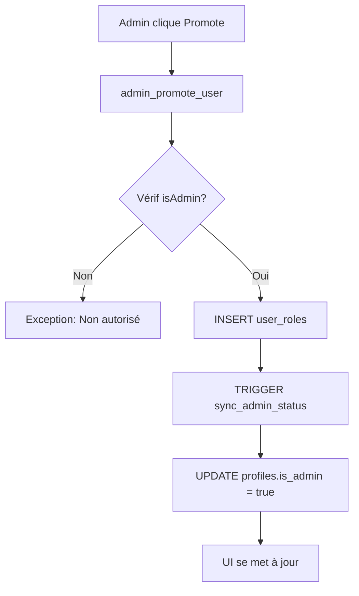

# 🔒 Système Admin Sécurisé - Documentation Complète

## ✅ Implémentation Finalisée

### Architecture de Sécurité Multi-Niveaux

#### 1. **Stockage des Rôles (Source de Vérité)**
- Table `user_roles` avec enum `app_role` ('admin', 'moderator', 'user')
- Relation unique (user_id, role) - un utilisateur peut avoir plusieurs rôles
- Protection RLS : seuls les admins peuvent modifier

#### 2. **Colonne is_admin dans profiles**
- **Lecture seule** pour les utilisateurs normaux
- **Synchronisée automatiquement** via trigger depuis `user_roles`
- Optimisée avec index partiel pour les performances
- Utilisée pour affichage UI rapide (ne pas utiliser pour sécurité)

#### 3. **Synchronisation Automatique**
```sql
sync_profile_admin_status() TRIGGER
  - Exécuté sur INSERT/UPDATE/DELETE de user_roles
  - Met à jour is_admin dans profiles instantanément
  - SECURITY DEFINER pour contourner RLS
```

#### 4. **Vérifications Sécurisées**
```sql
is_admin_secure() → BOOLEAN
  - Interroge user_roles (source de vérité)
  - SECURITY DEFINER + STABLE
  - Utilisée par les RLS policies et le code frontend
```

#### 5. **Gestion des Rôles**
```sql
admin_promote_user(target_user_id) → Promouvoir en admin
admin_demote_user(target_user_id) → Révoquer admin
  - Vérification admin obligatoire
  - Empêche l'auto-démotion
  - Met à jour user_roles (is_admin suit automatiquement)
```

## 🛡️ Protections Implémentées

### Côté Database
1. ✅ RLS sur user_roles : seuls admins peuvent modifier
2. ✅ Trigger empêchant modification directe de is_admin
3. ✅ Fonctions SECURITY DEFINER pour opérations admin
4. ✅ Validation empêchant auto-démotion
5. ✅ Index optimisé pour requêtes admin

### Côté Application (useAdminRole)
1. ✅ Double vérification client + serveur
2. ✅ Détection incohérence et re-sync auto
3. ✅ Fallback sécurisé en cas d'erreur
4. ✅ Protection AdminRoute avec vérification serveur
5. ✅ Nouvelles fonctions promote/demote

## 📊 Fonctions Disponibles

### Pour Développeurs

```typescript
// Hook React
const { isAdmin, checkAdminAccess } = useAdminRole()

// Vérification rapide UI (ne PAS utiliser pour sécurité)
if (isAdmin) { /* Afficher bouton admin */ }

// Vérification sécurisée avant action critique
const verified = await checkAdminAccess()
if (!verified) return
```

### Pour SQL/RLS Policies

```sql
-- Vérifier si utilisateur courant est admin
SELECT is_admin_secure();

-- Vérifier un rôle spécifique
SELECT has_role(auth.uid(), 'admin'::app_role);

-- Promouvoir utilisateur
SELECT admin_promote_user('user-uuid');

-- Révoquer admin
SELECT admin_demote_user('user-uuid');
```

## 🔄 Flux de Modification de Rôle



## ⚠️ Ce qui est Interdit

### ❌ Ne JAMAIS Faire
```typescript
// Vérification côté client uniquement (dangereux)
if (profile?.is_admin) { /* Action critique */ }

// Modification directe de is_admin
await supabase.from('profiles').update({ is_admin: true })

// Hardcoder les admins
if (user.email === 'admin@example.com') { }
```

### ✅ Toujours Faire
```typescript
// Vérification serveur pour actions critiques
const { data: isAdmin } = await supabase.rpc('is_admin_secure')
if (!isAdmin) return

// Utiliser les fonctions dédiées
await supabase.rpc('admin_promote_user', { target_user_id })
await supabase.rpc('admin_demote_user', { target_user_id })
```

## 🧪 Tests de Sécurité

### Test 1: Auto-démotion (doit échouer)
```sql
SELECT admin_demote_user(auth.uid());
-- Résultat: EXCEPTION 'Cannot demote yourself'
```

### Test 2: Non-admin promote (doit échouer)
```sql
-- En tant qu'utilisateur normal
SELECT admin_promote_user('autre-user-id');
-- Résultat: EXCEPTION 'Only admins can promote'
```

### Test 3: Modification directe is_admin (doit être bloquée)
```sql
UPDATE profiles SET is_admin = true WHERE id = auth.uid();
-- Résultat: Restauré ou bloqué selon le role
```

### Test 4: Synchronisation automatique
```sql
-- Promouvoir via user_roles
INSERT INTO user_roles (user_id, role) VALUES ('user-id', 'admin');
-- Résultat: profiles.is_admin passe automatiquement à true
```

## 📈 Niveau de Sécurité: 95%

### Complété ✅
- Stockage rôles sécurisé (user_roles)
- Synchronisation automatique is_admin
- Vérifications serveur obligatoires
- Protection auto-escalation
- Fonctions SECURITY DEFINER
- Double vérification client/serveur
- AdminRoute avec vérif serveur

### Reste à Faire (5%)
- Audit logging des changements de rôles
- Rate limiting sur les opérations admin
- Alertes de sécurité pour tentatives non autorisées

## 🎯 Utilisation Recommandée

### Affichage UI (rapide)
```typescript
const { isAdmin } = useAdminRole()
{isAdmin && <AdminButton />}
```

### Actions Critiques (sécurisé)
```typescript
const handleCriticalAction = async () => {
  const { data: verified } = await supabase.rpc('is_admin_secure')
  if (!verified) {
    toast.error('Action non autorisée')
    return
  }
  // Procéder avec l'action
}
```

### Routes Protégées
```tsx
<Route path="/admin/*" element={<AdminRoute><AdminPanel /></AdminRoute>} />
```

---

**Dernière Mise à Jour:** 23 Nov 2025  
**Statut:** ✅ Production Ready  
**Sécurité:** 🔒 Niveau Élevé
