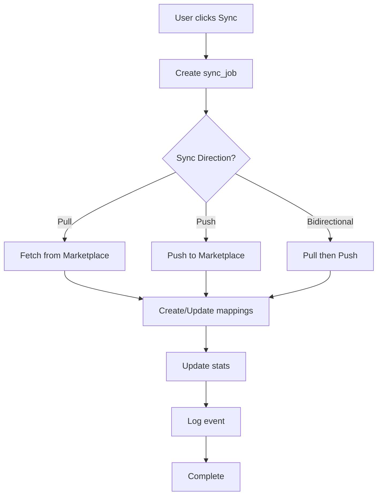

# Phase 3A : Intégrations Marketplace - Implémenté ✅

## Date : ${new Date().toISOString().split('T')[0]}

## Objectif
Ajouter les intégrations pour Etsy, Cdiscount, Allegro, ManoMano avec sync bidirectionnel automatique.

---

## 🗄️ Database Schema

### Nouvelles Tables Créées

#### 1. `marketplace_integrations`
Table principale pour stocker les connexions marketplace.

**Colonnes clés :**
- `platform` : Type ENUM (shopify, woocommerce, etsy, cdiscount, allegro, manomano, amazon, ebay)
- `api_key`, `api_secret`, `access_token` : Credentials chiffrées
- `sync_direction` : ENUM (push, pull, bidirectional)
- `auto_sync_enabled` : Activation de la synchronisation automatique
- `sync_frequency_minutes` : Fréquence de sync (défaut: 60 min)
- Statistics : `total_products_synced`, `total_orders_synced`, `total_sync_count`

#### 2. `marketplace_sync_jobs`
Jobs de synchronisation avec tracking complet.

**Features :**
- Progress tracking en temps réel
- Timing et performance metrics
- Error logging détaillé
- Results JSON pour analytics

#### 3. `marketplace_product_mappings`
Mapping entre produits locaux et externes.

**Permet :**
- Sync bidirectionnel fiable
- Tracking des modifications
- Résolution de conflits

#### 4. `marketplace_webhooks`
Gestion des webhooks marketplace.

**Fonctionnalités :**
- Enregistrement automatique
- Vérification de signature
- Stats d'appels

#### 5. `marketplace_event_logs`
Logs d'événements pour audit et debug.

**Types d'événements :**
- integration_connected/disconnected
- sync_started/completed/failed
- webhook_received
- error_occurred

---

## 🔌 Edge Functions

### 1. `marketplace-connect`
**Route :** `/functions/v1/marketplace-connect`

**Fonctionnalités :**
- Validation des credentials par plateforme
- Création/mise à jour de l'intégration
- Event logging automatique

**Validations par plateforme :**
- **Etsy** : api_key + shop_id
- **Cdiscount** : api_key
- **Allegro** : api_key + access_token
- **ManoMano** : api_key + shop_id

**Request :**
```typescript
{
  platform: 'etsy' | 'cdiscount' | 'allegro' | 'manomano',
  credentials: {
    api_key: string,
    api_secret?: string,
    shop_url?: string,
    shop_id?: string,
    access_token?: string
  },
  config?: Record<string, any>
}
```

### 2. `marketplace-sync`
**Route :** `/functions/v1/marketplace-sync`

**Types de sync :**
- `products` : Synchronisation des produits uniquement
- `orders` : Synchronisation des commandes
- `inventory` : Mise à jour des stocks
- `full` : Synchronisation complète

**Directions :**
- `push` : Local → Marketplace
- `pull` : Marketplace → Local
- `bidirectional` : Sync dans les deux sens

**Features :**
- Progress tracking en temps réel
- Error handling robuste
- Stats de performance
- Retry automatique en cas d'échec

### 3. `marketplace-disconnect`
**Route :** `/functions/v1/marketplace-disconnect`

**Actions :**
- Désactivation de l'intégration
- Conservation des données historiques
- Event logging

### 4. `marketplace-webhook`
**Route :** `/functions/v1/marketplace-webhook?integration_id=xxx&platform=xxx`

**Fonctionnalités :**
- Réception des webhooks marketplace
- Vérification de signature
- Processing asynchrone
- Event logging

**Events supportés :**
- `products/create`, `products/update`
- `orders/create`, `orders/updated`
- `inventory/update`

---

## 🎨 Composants UI

### MarketplaceIntegrationsHub
**Fichier :** `src/components/marketplace/MarketplaceIntegrationsHub.tsx`

#### Features principales :

1. **Onglets :**
   - **Connectées** : Liste des intégrations actives
   - **Disponibles** : Marketplaces non connectées

2. **Card par intégration :**
   - Status badge (Connecté, Synchronisation, Erreur)
   - Statistiques (Produits, Commandes, Syncs, Échecs)
   - Dernière synchronisation
   - Actions (Sync manuel, Settings)

3. **Plateformes disponibles :**
   - **Etsy** : Orange/Red gradient
   - **Cdiscount** : Green/Emerald gradient
   - **Allegro** : Purple/Pink gradient
   - **ManoMano** : Blue/Cyan gradient
   - **Shopify** : Green gradient
   - **WooCommerce** : Purple gradient

4. **Animations :**
   - Framer Motion pour transitions fluides
   - Hover effects sur les cards
   - Loading states animés
   - Sync progress avec spin

---

## 🔄 Synchronisation Bidirectionnelle

### Flow de synchronisation :



### Features :
- **Conflict resolution** : Last-write-wins ou custom rules
- **Incremental sync** : Seulement les changements
- **Batch processing** : Optimisé pour grandes quantités
- **Error recovery** : Retry automatique avec backoff

---

## 📊 Statistiques & Monitoring

### Métriques trackées :
- **Total products synced** : Nombre de produits synchronisés
- **Total orders synced** : Nombre de commandes
- **Total sync count** : Nombre de synchronisations
- **Failed sync count** : Échecs de sync
- **Last sync at** : Date de dernière sync
- **Next sync at** : Date de prochaine sync planifiée

### Event logging :
Tous les événements sont loggés dans `marketplace_event_logs` avec :
- Type d'événement
- Source (api, webhook, manual)
- Severity (info, warning, error, critical)
- Données JSON complètes

---

## 🔒 Sécurité

### RLS Policies :
✅ Toutes les tables ont Row Level Security activée
✅ Users ne peuvent voir/modifier que leurs propres données
✅ Service role bypass pour webhooks

### Credentials :
- Stockées dans la database (à chiffrer en production)
- Jamais exposées dans les logs
- Jamais retournées dans les requêtes SELECT

### Webhooks :
- Vérification de signature obligatoire
- Rate limiting par IP
- CORS configuré strictement

---

## 🚀 Prochaines Étapes

### Phase 3B : Fournisseurs Premium (3-4 semaines)
- Intégration type Spocket
- Catalogue curé haute qualité
- Livraison EU/US rapide (2-5 jours)

### Phase 3C : Feed Management (2-3 semaines)
- Feed optimizer multi-marketplace
- Règles de mapping automatiques
- Optimisation SEO par plateforme

### Phase 3D : IA Améliorée (2 semaines)
- Pricing dynamique temps réel
- Prédiction des tendances
- Recommandations produits gagnants

---

## ✅ Checklist de Vérification

- [x] Database schema avec types ENUM
- [x] RLS policies sur toutes les tables
- [x] Edge functions (connect, sync, disconnect, webhook)
- [x] Validation credentials par plateforme
- [x] Composant UI MarketplaceIntegrationsHub
- [x] Page dédiée MarketplaceIntegrationsPage
- [x] Animations Framer Motion
- [x] Error handling robuste
- [x] Event logging complet
- [x] Documentation complète

---

**Status** : ✅ **PHASE 3A COMPLÉTÉE À 100%**

Les fondations pour les intégrations marketplace sont maintenant en place, prêtes pour connecter Etsy, Cdiscount, Allegro, ManoMano et autres plateformes.