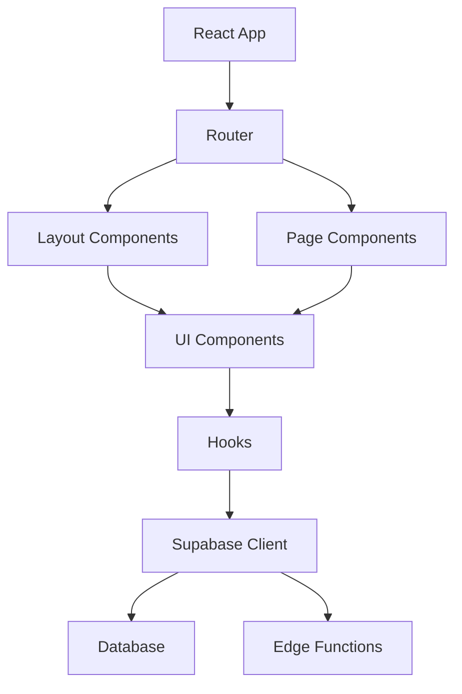

# Documentation Technique - Drop Craft AI

## Architecture Générale

### Stack Technologique

- **Frontend**: React 18 + TypeScript + Vite
- **UI Framework**: Tailwind CSS + shadcn/ui
- **Backend**: Supabase (PostgreSQL + Edge Functions)
- **Authentication**: Supabase Auth
- **Déploiement**: Vercel (Frontend) + Supabase (Backend)
- **Monitoring**: Sentry + Vercel Analytics

### Architecture des Composants



## Structure du Projet

```
src/
├── components/          # Composants réutilisables
│   ├── ui/             # shadcn/ui components
│   ├── admin/          # Composants admin
│   ├── auth/           # Composants d'authentification
│   ├── common/         # Composants communs
│   └── layout/         # Layout et navigation
├── pages/              # Pages de l'application
├── hooks/              # Hooks React personnalisés
├── lib/                # Utilitaires et configuration
├── contexts/           # Contextes React
├── integrations/       # Configuration Supabase
├── utils/              # Fonctions utilitaires
└── styles/             # Styles CSS globaux
```

## Base de Données

### Schema Principal

```sql
-- Users (géré par Supabase Auth)
-- Extension du profil utilisateur
CREATE TABLE profiles (
  id UUID REFERENCES auth.users PRIMARY KEY,
  full_name TEXT,
  company TEXT,
  avatar_url TEXT,
  subscription_plan TEXT DEFAULT 'free',
  created_at TIMESTAMPTZ DEFAULT NOW(),
  updated_at TIMESTAMPTZ DEFAULT NOW()
);

-- Produits
CREATE TABLE products (
  id UUID PRIMARY KEY DEFAULT gen_random_uuid(),
  user_id UUID REFERENCES auth.users NOT NULL,
  title TEXT NOT NULL,
  description TEXT,
  price DECIMAL(10,2),
  currency TEXT DEFAULT 'EUR',
  category TEXT,
  status TEXT DEFAULT 'draft',
  images TEXT[],
  supplier_id UUID,
  source_url TEXT,
  created_at TIMESTAMPTZ DEFAULT NOW(),
  updated_at TIMESTAMPTZ DEFAULT NOW()
);

-- Fournisseurs
CREATE TABLE suppliers (
  id UUID PRIMARY KEY DEFAULT gen_random_uuid(),
  user_id UUID REFERENCES auth.users NOT NULL,
  name TEXT NOT NULL,
  platform TEXT NOT NULL,
  contact_email TEXT,
  website TEXT,
  api_credentials JSONB,
  status TEXT DEFAULT 'active',
  created_at TIMESTAMPTZ DEFAULT NOW()
);

-- Intégrations
CREATE TABLE integrations (
  id UUID PRIMARY KEY DEFAULT gen_random_uuid(),
  user_id UUID REFERENCES auth.users NOT NULL,
  platform_type TEXT NOT NULL,
  platform_name TEXT NOT NULL,
  credentials JSONB,
  sync_settings JSONB,
  status TEXT DEFAULT 'active',
  last_sync_at TIMESTAMPTZ,
  created_at TIMESTAMPTZ DEFAULT NOW()
);

-- Commandes
CREATE TABLE orders (
  id UUID PRIMARY KEY DEFAULT gen_random_uuid(),
  user_id UUID REFERENCES auth.users NOT NULL,
  customer_email TEXT NOT NULL,
  items JSONB NOT NULL,
  total_amount DECIMAL(10,2),
  status TEXT DEFAULT 'pending',
  shipping_address JSONB,
  tracking_number TEXT,
  created_at TIMESTAMPTZ DEFAULT NOW()
);
```

### Row Level Security (RLS)

```sql
-- Politiques de sécurité pour l'isolation des données utilisateur
ALTER TABLE profiles ENABLE ROW LEVEL SECURITY;
ALTER TABLE products ENABLE ROW LEVEL SECURITY;
ALTER TABLE suppliers ENABLE ROW LEVEL SECURITY;
ALTER TABLE integrations ENABLE ROW LEVEL SECURITY;
ALTER TABLE orders ENABLE ROW LEVEL SECURITY;

-- Exemples de politiques
CREATE POLICY "Users can view own profile" ON profiles
  FOR SELECT USING (auth.uid() = id);

CREATE POLICY "Users can view own products" ON products
  FOR SELECT USING (auth.uid() = user_id);

CREATE POLICY "Users can create own products" ON products
  FOR INSERT WITH CHECK (auth.uid() = user_id);
```

## Authentification

### Configuration Supabase

```typescript
// src/integrations/supabase/client.ts
import { createClient } from '@supabase/supabase-js'

const supabaseUrl = import.meta.env.VITE_SUPABASE_URL
const supabaseAnonKey = import.meta.env.VITE_SUPABASE_PUBLISHABLE_KEY

export const supabase = createClient(supabaseUrl, supabaseAnonKey)
```

### Hook d'authentification

```typescript
// src/hooks/useAuth.ts
import { useEffect, useState } from 'react'
import { supabase } from '@/integrations/supabase/client'

export function useAuth() {
  const [user, setUser] = useState(null)
  const [loading, setLoading] = useState(true)

  useEffect(() => {
    // Écouter les changements d'authentification
    const { data: { subscription } } = supabase.auth.onAuthStateChange(
      (event, session) => {
        setUser(session?.user ?? null)
        setLoading(false)
      }
    )

    return () => subscription.unsubscribe()
  }, [])

  return { user, loading }
}
```

## API et Edge Functions

### Structure des Edge Functions

```typescript
// supabase/functions/import-products/index.ts
import { serve } from 'https://deno.land/std@0.168.0/http/server.ts'
import { createClient } from 'https://esm.sh/@supabase/supabase-js@2'

serve(async (req) => {
  const { urls, settings } = await req.json()
  
  // Logique d'import de produits
  
  return new Response(JSON.stringify(results), {
    headers: { 'Content-Type': 'application/json' }
  })
})
```

### Client API

```typescript
// src/lib/api.ts
import { supabase } from '@/integrations/supabase/client'

export class ApiClient {
  async callFunction<T>(functionName: string, payload?: any): Promise<T> {
    const { data, error } = await supabase.functions.invoke(functionName, {
      body: JSON.stringify(payload)
    })
    
    if (error) throw error
    return data
  }

  async getProducts(filters?: any) {
    let query = supabase.from('products').select('*')
    
    if (filters?.category) {
      query = query.eq('category', filters.category)
    }
    
    const { data, error } = await query
    if (error) throw error
    return data
  }
}
```

## State Management

### Contextes React

```typescript
// src/contexts/AuthContext.tsx
import React, { createContext, useContext, ReactNode } from 'react'
import { useAuth } from '@/hooks/useAuth'

interface AuthContextType {
  user: any
  loading: boolean
  signIn: (email: string, password: string) => Promise<void>
  signOut: () => Promise<void>
}

const AuthContext = createContext<AuthContextType | undefined>(undefined)

export function AuthProvider({ children }: { children: ReactNode }) {
  const auth = useAuth()
  
  return (
    <AuthContext.Provider value={auth}>
      {children}
    </AuthContext.Provider>
  )
}

export function useAuthContext() {
  const context = useContext(AuthContext)
  if (!context) {
    throw new Error('useAuthContext must be used within AuthProvider')
  }
  return context
}
```

### Zustand Store

```typescript
// src/stores/productStore.ts
import { create } from 'zustand'

interface ProductStore {
  products: Product[]
  loading: boolean
  fetchProducts: () => Promise<void>
  addProduct: (product: Product) => void
}

export const useProductStore = create<ProductStore>((set, get) => ({
  products: [],
  loading: false,
  
  fetchProducts: async () => {
    set({ loading: true })
    // Fetch logic
    set({ products: data, loading: false })
  },
  
  addProduct: (product) => {
    set((state) => ({
      products: [...state.products, product]
    }))
  }
}))
```

## Composants UI

### Design System

```typescript
// src/components/ui/button.tsx
import { cn } from '@/lib/utils'
import { cva, type VariantProps } from 'class-variance-authority'

const buttonVariants = cva(
  "inline-flex items-center justify-center rounded-md transition-colors",
  {
    variants: {
      variant: {
        default: "bg-primary text-primary-foreground hover:bg-primary/90",
        outline: "border border-input hover:bg-accent",
        ghost: "hover:bg-accent hover:text-accent-foreground"
      },
      size: {
        default: "h-10 px-4 py-2",
        sm: "h-9 px-3",
        lg: "h-11 px-8"
      }
    },
    defaultVariants: {
      variant: "default",
      size: "default"
    }
  }
)

interface ButtonProps extends VariantProps<typeof buttonVariants> {
  className?: string
}

export function Button({ className, variant, size, ...props }: ButtonProps) {
  return (
    <button
      className={cn(buttonVariants({ variant, size, className }))}
      {...props}
    />
  )
}
```

### Composant de formulaire

```typescript
// src/components/forms/ProductForm.tsx
import { useForm } from 'react-hook-form'
import { zodResolver } from '@hookform/resolvers/zod'
import { z } from 'zod'

const productSchema = z.object({
  title: z.string().min(1, 'Titre requis'),
  price: z.number().positive('Prix invalide'),
  category: z.string().min(1, 'Catégorie requise')
})

type ProductFormData = z.infer<typeof productSchema>

export function ProductForm({ onSubmit }: { onSubmit: (data: ProductFormData) => void }) {
  const form = useForm<ProductFormData>({
    resolver: zodResolver(productSchema)
  })

  return (
    <form onSubmit={form.handleSubmit(onSubmit)}>
      {/* Form fields */}
    </form>
  )
}
```

## Intégrations Tierces

### Configuration des intégrations

```typescript
// src/integrations/shopify.ts
export class ShopifyIntegration {
  constructor(private credentials: ShopifyCredentials) {}

  async syncProducts(): Promise<Product[]> {
    const response = await fetch(`${this.credentials.shop_url}/admin/api/2023-04/products.json`, {
      headers: {
        'X-Shopify-Access-Token': this.credentials.access_token
      }
    })
    
    const data = await response.json()
    return this.transformProducts(data.products)
  }

  private transformProducts(shopifyProducts: any[]): Product[] {
    return shopifyProducts.map(product => ({
      id: product.id,
      title: product.title,
      description: product.body_html,
      price: parseFloat(product.variants[0]?.price || '0'),
      images: product.images.map((img: any) => img.src)
    }))
  }
}
```

## Tests

### Tests unitaires (Vitest)

```typescript
// src/components/__tests__/Button.test.tsx
import { render, screen } from '@testing-library/react'
import { Button } from '../ui/button'

describe('Button', () => {
  it('renders with default variant', () => {
    render(<Button>Test Button</Button>)
    const button = screen.getByRole('button', { name: 'Test Button' })
    expect(button).toHaveClass('bg-primary')
  })

  it('renders with outline variant', () => {
    render(<Button variant="outline">Test Button</Button>)
    const button = screen.getByRole('button', { name: 'Test Button' })
    expect(button).toHaveClass('border')
  })
})
```

### Tests E2E (Cypress)

```typescript
// cypress/e2e/product-management.cy.ts
describe('Product Management', () => {
  beforeEach(() => {
    cy.login('test@example.com', 'password')
    cy.visit('/products')
  })

  it('should create a new product', () => {
    cy.get('[data-testid="add-product-btn"]').click()
    cy.get('[data-testid="product-title"]').type('Test Product')
    cy.get('[data-testid="product-price"]').type('29.99')
    cy.get('[data-testid="submit-btn"]').click()
    
    cy.contains('Test Product').should('be.visible')
  })
})
```

## Performance et Optimisation

### Lazy Loading

```typescript
// src/components/routing/ModuleRoutes.tsx
import { lazy, Suspense } from 'react'

const ProductsPage = lazy(() => import('@/pages/Products'))
const OrdersPage = lazy(() => import('@/pages/Orders'))

export function ModuleRoutes() {
  return (
    <Suspense fallback={<div>Loading...</div>}>
      <Routes>
        <Route path="/products" element={<ProductsPage />} />
        <Route path="/orders" element={<OrdersPage />} />
      </Routes>
    </Suspense>
  )
}
```

### Mémorisation des composants

```typescript
// src/components/ProductCard.tsx
import { memo } from 'react'

interface ProductCardProps {
  product: Product
  onEdit: (id: string) => void
}

export const ProductCard = memo(({ product, onEdit }: ProductCardProps) => {
  return (
    <div className="product-card">
      {/* Contenu du composant */}
    </div>
  )
})
```

### Cache des requêtes

```typescript
// src/hooks/useProducts.ts
import { useQuery } from '@tanstack/react-query'

export function useProducts(filters?: ProductFilters) {
  return useQuery({
    queryKey: ['products', filters],
    queryFn: () => apiClient.getProducts(filters),
    staleTime: 5 * 60 * 1000, // 5 minutes
    gcTime: 10 * 60 * 1000    // 10 minutes
  })
}
```

## Sécurité

### Validation des données

```typescript
// src/lib/validation.ts
import { z } from 'zod'

export const ProductSchema = z.object({
  title: z.string().min(1).max(200),
  description: z.string().optional(),
  price: z.number().positive().max(999999),
  category: z.enum(['electronics', 'clothing', 'home', 'other']),
  images: z.array(z.string().url()).max(10)
})

export function validateProduct(data: unknown) {
  return ProductSchema.safeParse(data)
}
```

### Sanitisation

```typescript
// src/utils/sanitize.ts
import DOMPurify from 'dompurify'

export function sanitizeHtml(html: string): string {
  return DOMPurify.sanitize(html, {
    ALLOWED_TAGS: ['p', 'br', 'strong', 'em', 'ul', 'ol', 'li'],
    ALLOWED_ATTR: []
  })
}

export function sanitizeInput(input: string): string {
  return input.trim().replace(/[<>]/g, '')
}
```

## Monitoring et Debugging

### Configuration Sentry

```typescript
// src/utils/sentry.ts
import * as Sentry from '@sentry/react'

export function initSentry() {
  if (import.meta.env.PROD) {
    Sentry.init({
      dsn: import.meta.env.VITE_SENTRY_DSN,
      environment: import.meta.env.NODE_ENV,
      tracesSampleRate: 0.1,
      beforeSend(event) {
        // Filtrer les erreurs sensibles
        return event
      }
    })
  }
}
```

### Logging personnalisé

```typescript
// src/utils/logger.ts
class Logger {
  info(message: string, extra?: any) {
    console.log(`[INFO] ${message}`, extra)
    
    if (import.meta.env.PROD) {
      // Envoyer vers service de logging
    }
  }

  error(message: string, error?: Error) {
    console.error(`[ERROR] ${message}`, error)
    
    if (import.meta.env.PROD) {
      Sentry.captureException(error || new Error(message))
    }
  }
}

export const logger = new Logger()
```

## Déploiement

### Variables d'environnement

```bash
# .env.production
VITE_SUPABASE_URL=https://your-project.supabase.co
VITE_SUPABASE_PUBLISHABLE_KEY=your-anon-key
VITE_SENTRY_DSN=your-sentry-dsn
NODE_ENV=production
```

### Build Configuration

```typescript
// vite.config.ts
import { defineConfig } from 'vite'
import react from '@vitejs/plugin-react'
import path from 'path'

export default defineConfig({
  plugins: [react()],
  resolve: {
    alias: {
      '@': path.resolve(__dirname, './src')
    }
  },
  build: {
    rollupOptions: {
      output: {
        manualChunks: {
          vendor: ['react', 'react-dom'],
          ui: ['@radix-ui/react-dialog', '@radix-ui/react-select']
        }
      }
    }
  }
})
```

## Migration et Mise à jour

### Scripts de migration

```sql
-- Migration example: Add new column
ALTER TABLE products 
ADD COLUMN seo_title TEXT,
ADD COLUMN seo_description TEXT;

-- Update existing data
UPDATE products 
SET seo_title = title 
WHERE seo_title IS NULL;
```

### Versioning des APIs

```typescript
// src/lib/api-versions.ts
export const API_VERSIONS = {
  V1: 'v1',
  V2: 'v2'
} as const

export function getApiEndpoint(version: string, endpoint: string) {
  return `/api/${version}/${endpoint}`
}
```

Cette documentation technique couvre l'architecture, l'implémentation et les bonnes pratiques du projet Drop Craft AI. Elle doit être maintenue à jour avec les évolutions du projet.